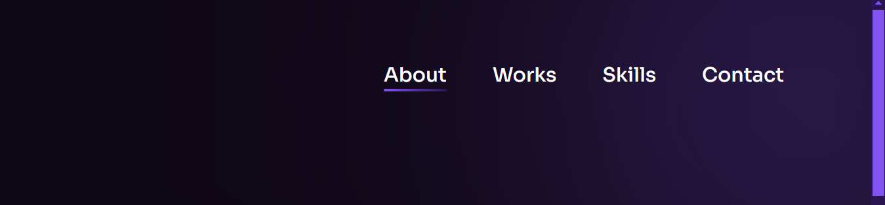
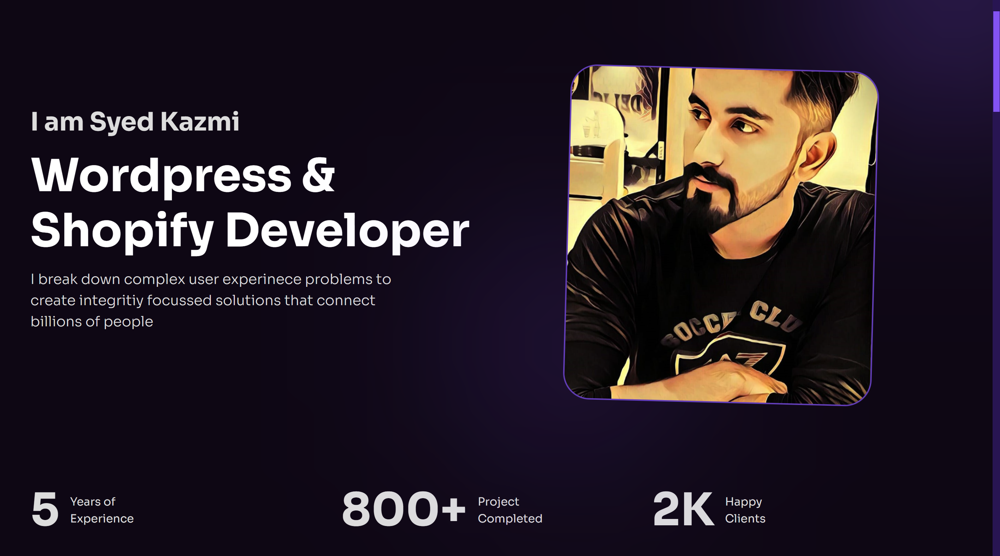
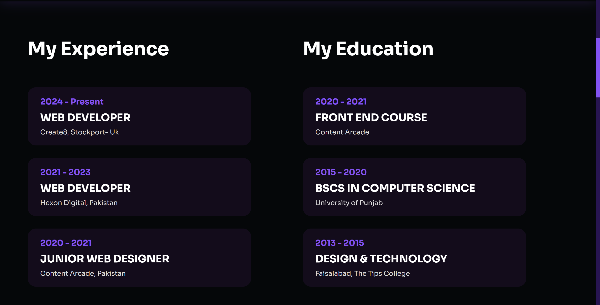
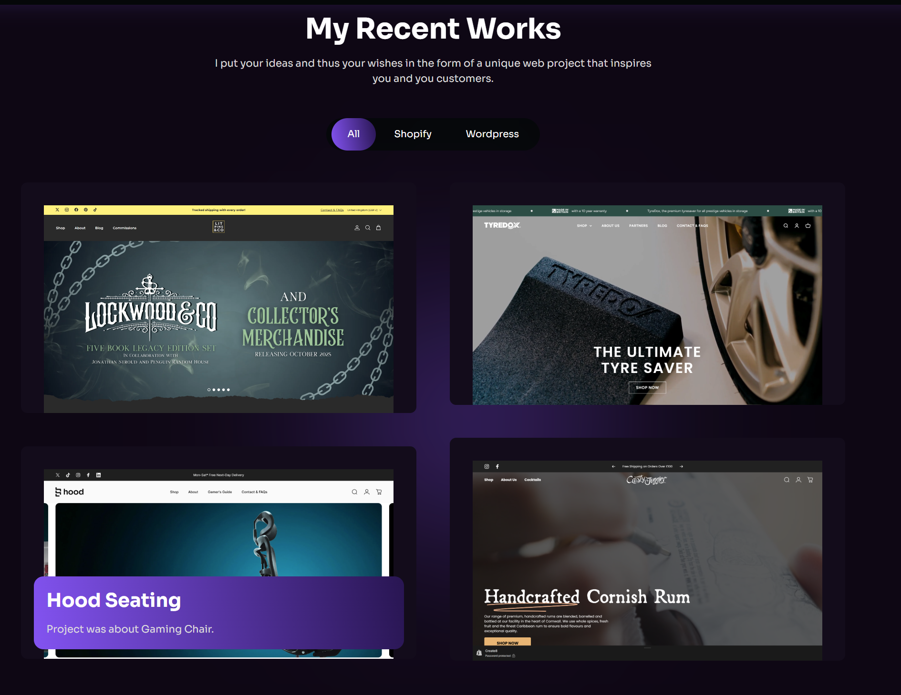
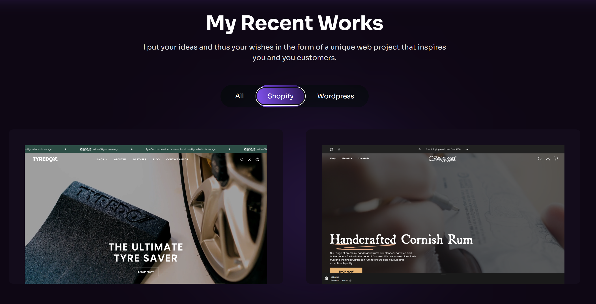
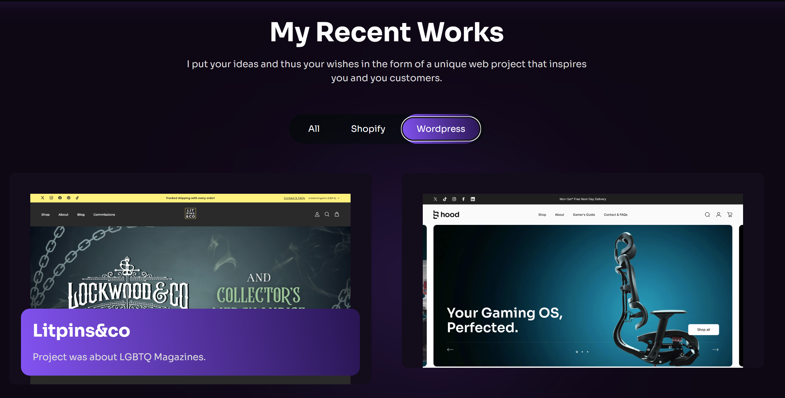
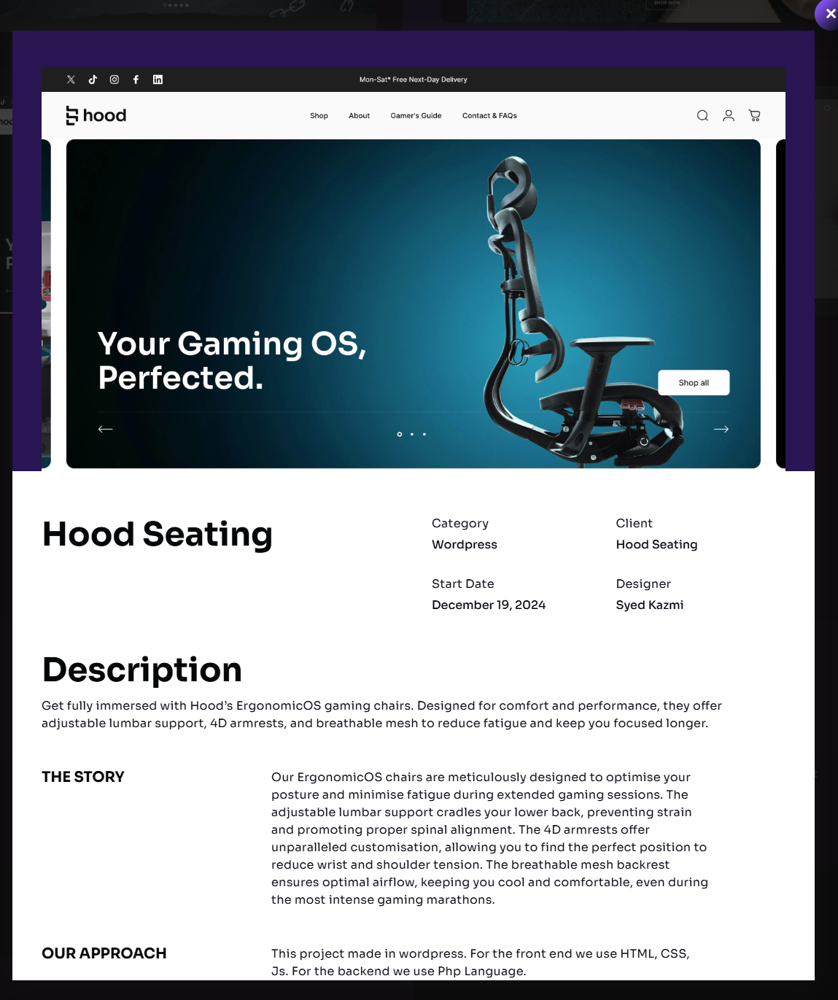
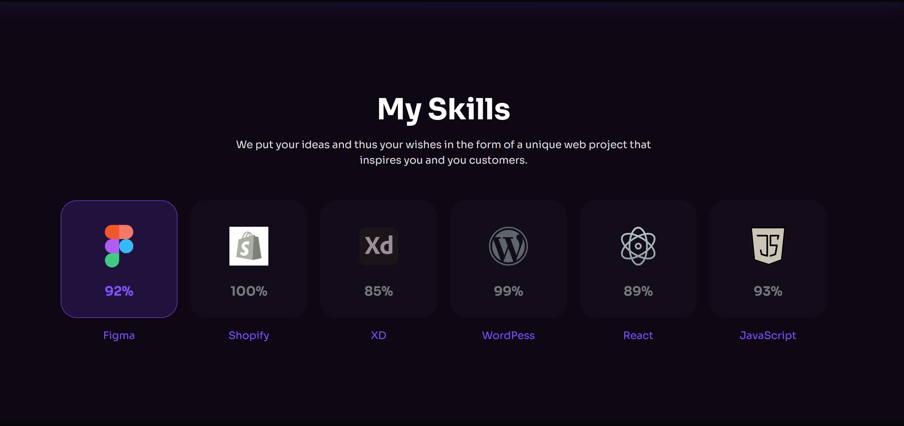
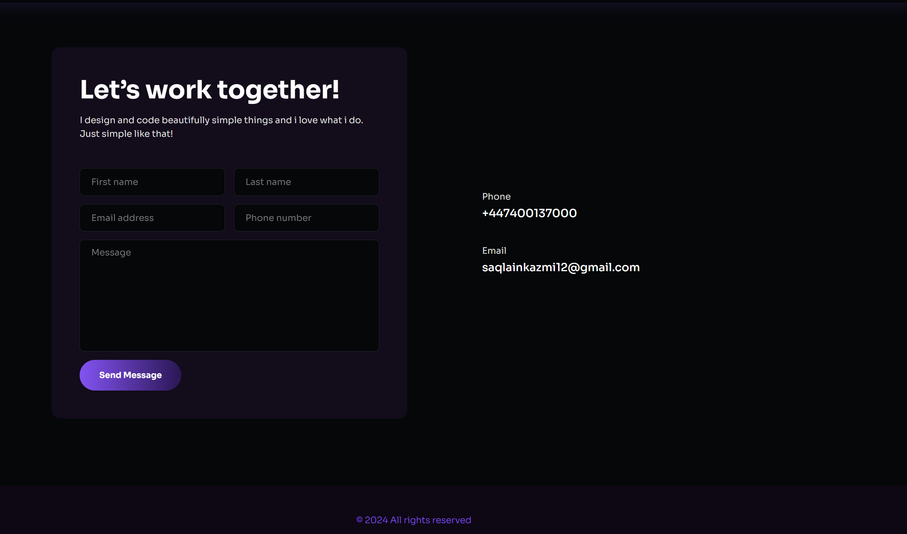
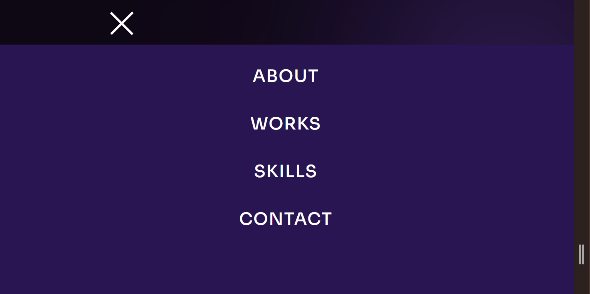

## Overview

Welcome to my personal portfolio! Here you'll find an overview of my professional journey, the projects I've worked on, and the skills I bring to the table.

The website can be accessed by this [Link](https://syedkazmidev.github.io/Personal-Portfolio/)

## Introduction

Hi there! Welcome to my portfolio. I'm Syed, a wordpress developer and front end developer. This portfolio is a showcase of my journey, skills, and the projects that I've poured my creativity and dedication into.

Here, you'll find highlights of my work, a glimpse into my professional experience, and the tools and technologies that I love working with. Whether you're here to collaborate, connect, or just learn more about me, I hope you enjoy exploring my portfolio.

## Features

<h3>The website exists on one page only with multiple features visible to the user and responsiveness:</h3>

- At the top of the page, a navbar with hover effects when clicked it takes you to the section selected
 

- Next is the about page with a brief introduction of myself with my photo.
 

- Then there is the education and work experience secion which shows you information about where i got my education and information about work experience. 

- I have a section dedicated to my work I have done with a filter that shows projects when shopify is selected and projects when wordpress is selected. It also has a pop up info for the projects when selected to give more description of the project, when created, the client, what the client is about and languages used.
 

-The next section is the skills. This sections demonstrates the skills I have and also obtained while doing the front-end course.
 

- The last section is the contacts section which shows my contact details as well as a form to fill in which will be sent to email.
 

- I have also made the personal portfolio responsive adjusting to max width of screen sizes which also includes a hamburger menu for smaller screen sizes.
 

## Technologies Used

- HTML- was used as the foundation of the site.
- CSS- was used to add the styles and layout of the site.
- Javascript- was used to create all the logic and visuals necessary for personal portfolio.
- VScode- was used as the main tool to write and edit code.
- Git- was used for the version control of the website to push and commit.
- Github- was used to host the code of the website.

